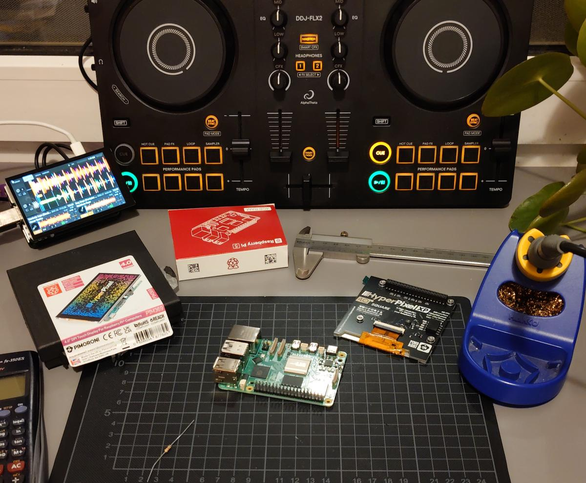

# Pioneer DDJ-FLX Mixxx Mappings

Custom Mixxx controller mappings for the Pioneer/AlphaTheta DDJ-FLX2 and
DDJ-FLX4. These mappings are based on the DDJ-400 mapping work and adjusted to
provide a practical rekordbox-style workflow in Mixxx.



Mainly used in my [standalone mixxx setup](https://github.com/ghztomash/StandaloneMixxx).

## Features

- Standard deck, mixer, jog wheel, performance pad, Beat FX, and CFX controls
  where the hardware supports them.
- Improved FLX4 library browsing workflow: the browse encoder automatically
  opens the maximized library, scrolls tracks, switches between the track table
  and sidebar, and loads the selected track with the deck load buttons.
- Improved FLX2 library browsing workflow: Library Mode provides browsing and
  loading even though the controller has no dedicated browse encoder or load
  buttons.
- FLX2 trim control via `Shift + EQ Hi`, because the FLX2 has no Trim knobs.
- FLX2 `Shift + Beat Loop` pads provide Beat Jump shortcuts.
- FLX2 `Shift + Headphone Cue CH` toggles quantize outside Library Mode and
  loads the selected track while in Library Mode.
- FLX2 Smart CFX approximation toggles deck QuickEffect presets between
  `Moog Filter` and `Filter Echo`.

See `resources/FLX2_MIDI.md` for the full FLX2 custom behavior summary.

## Installation

Add these files into your Mixxx controllers directory:

```sh
git clone https://github.com/ghztomash/FLX-Mixxx.git ~/.mixxx/controllers
```

Then open Mixxx and select the DDJ-FLX2 or DDJ-FLX4 device in
`Preferences` -> `Controllers`. Load the matching mapping named
`Pioneer DDJ-FLX2-ghz` or `Pioneer DDJ-FLX4-ghz`.

## FLX4

The FLX4 mapping keeps the dedicated browse encoder and load buttons, with
small workflow improvements for Mixxx:

- Turning the browse encoder opens the maximized library and focuses the track
  table before scrolling.
- Pressing the encoder opens the selected sidebar item when the sidebar is
  focused.
- `Shift + Browse` moves focus from the track table to the sidebar, then moves
  back through the sidebar hierarchy.
- `Load 1` and `Load 2` load the selected track and close the maximized library.

## FLX2

Library Mode was added for browsing and loading without a dedicated browse
encoder or load buttons.

- `Shift + Smart Fader`: enter Library Mode and show the maximized library.
- `Smart Fader`: exit Library Mode.
- Side jog wheels: scroll the library while Library Mode is active.
- `Headphone Cue CH 1`: Back.
- `Headphone Cue CH 2`: Open/Enter.
- `Shift + Headphone Cue CH 1/2`: load selected track to deck 1/2 and exit
  Library Mode.
- Controller Settings include an FLX2 vinyl mode toggle. When disabled,
  jog platter rotation pitch-bends/nudges instead of scratching.

## Contributors

- [Tomash GHz](https://github.com/ghztomash)

Based on the work of:

- Warker
- nschloe
- dj3730
- jusko
- Robert904
